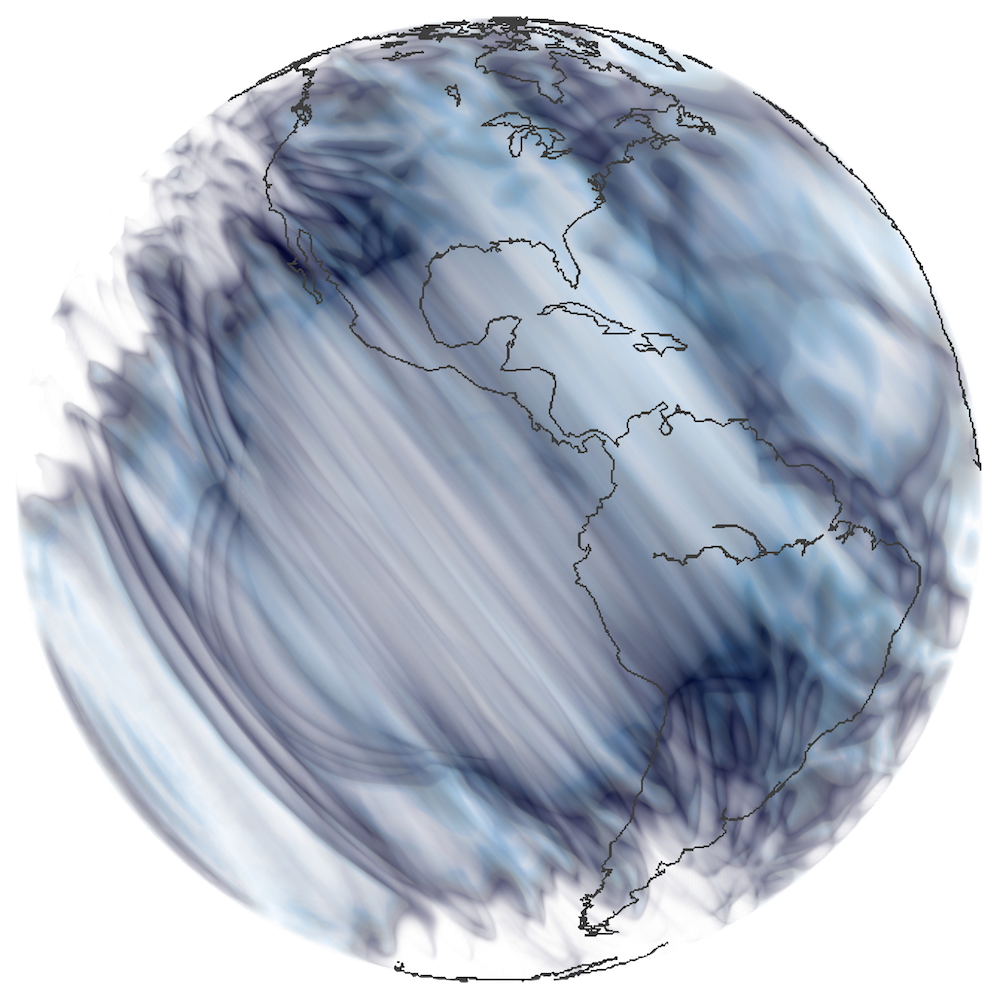

# Computational Geophysics - Course

This repository holds additional course material to teach computational geophysics.

## Syllabus

An introduction to finite-difference, pseudo-spectral, finite-element, and spectral-element methods will be presented
and applied to basic geophysical problems including heat flow and wave propagation.

The course offers hands-on lab experience in numerically solving partial differential equations relevant to geophysics.

<!--  -->

### Time and Location

- Sun/Thu, 15:00 - 16:30 KAUST time
- remote teaching class

### Instructor: Daniel Peter
- KAUST building 1, office #0146  
- daniel.peter@kaust.edu.sa

The material in this repository is used for teaching purposes. You may reuse it freely to produce, share and build on knowledge - education is open to all.

### Current Content

Whenever possible, we record these online classes and will provide them also as youtube videos.
Please feel free to join in the class at the time mentioned above, just send me an email to make sure that I recognize you in the waiting room:

[https://kaust.zoom.us/j/92849861020](https://kaust.zoom.us/j/92849861020)

The video lectures so far:

| Lecture | youtube video |
| ---     | ---           |
| welcome |  |
| 1 - conservation of mass |  |
| 2 - conservation of linear momentum |  |
| 3 - conservation of energy |  | 
| 4 - conservation of angular momentum |  |
| 5 - stability analysis |  |
| 6 - higher order finite-differences |  |

embarrassing, but hopefully more to come... :)

